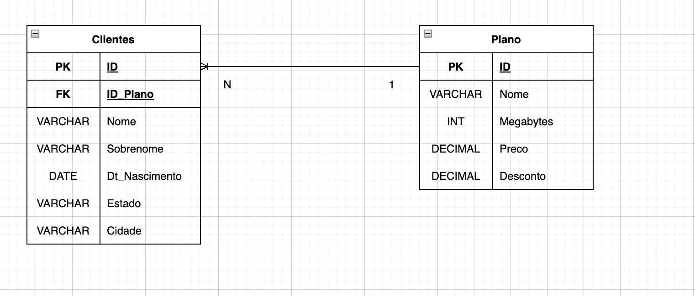

# Exercicios Banco de Dados
<h1> Banco Relacional MySQL </h1>
<h1>Dia 1</h1>
<h2>Exercicio 1</h2>
<p>Uma loja de móveis precisa da implementação de um banco de dados para controlar as
vendas que realiza por dia, o estoque de seus itens (produtos) e a lista dos seus clientes
que fazem compras.</p>

<h4>Você precisa modelar:</h4>
<ul>
  <li>Quais seriam as entidades desse sistema?</li>
  <li>Quais atributos serão determinados para cada entidade? (Considere aqueles que são considerados necessários)</li>
  <li>Como os relacionamentos entre as entidades serão moldados? Quais seriam as cardinalidades?</li>
  <li>Crie um DER para modelar o cenário proposto.</li>
</ul>


<h2>Exercicio 2</h2>
<p>Uma empresa provedora de Internet precisa de um banco de dados para armazenar cada um de
seus clientes junto com o plano/pacote que ele contratou.</p>

<h4>Através de uma análise prévia, sabe-se que as seguintes informações devem ser armazenadas:</h4>
<ul>
  <li> Deve ser registrado dos cliente: ID, nome, sobrenome, data de nascimento, estado, cidade. </li>
  <li> Quanto aos planos de internet: identificação do plano, velocidade oferecida em megabytes, preço, desconto. </li>
</ul>

<h3>1. Após enunciados os requisitos da empresa, solicita-se modelá-los por meio de um DER (Diagrama Entidade-Relacionamento).</h3>


<h3>2.Responda</h3>
<ol>
  <li>Qual é a chave primária para a tabela de clientes? Id, cada cliente terá um id único (poderia ser o cpf tambem)</li>
  <li>Qual é a chave primária da tabela de planos de internet? Id, cada plano terá um id único</li>
  <li>
    <ul>
      <li>Como seriam as relações entre as tabelas? 1 Plano para N Clientes  </li>
      <li>Em qual tabela deve estar chave estrangeira? Clientes </li>
      <li>A qual campo de qual tabela essa chave estrangeira se refere? Id do plano é a fk do cliente pois ele deve estar associado com apenas um plano </li>
    </ul>
   </li>  
</ol>

<h3>3.Faça</h3>
<ol>
<li>Crie um novo banco de dados chamado “empresa_internet”.</li>
<li>Insira 10 registros na tabela de clientes e 5 na tabela de planos de internet.</li>
<li>Faça as associações/relacionamentos correspondentes entre esses registros.</li>
</ol>

```bash
//CRIACAO DAS TABELAS
CREATE TABLE  Planos (
ID int UNSIGNED AUTO_INCREMENT,
Nome VARCHAR(255) NOT NULL,
Megabytes int NOT NULL,
Preco DECIMAL(7,2) NOT NULL,
Desconto DECIMAL(7,2) NOT NULL,
PRIMARY KEY (ID)

);

CREATE TABLE Clientes(
ID int UNSIGNED AUTO_INCREMENT,
ID_Plano int UNSIGNED,
Nome VARCHAR(255) NOT NULL,
Sobrenome VARCHAR(255)  NOT NULL,
Dt_Nascimento DATE  NOT NULL,
Estado VARCHAR(2) NOT NULL,
Cidade VARCHAR(255) NOT NULL, 

PRIMARY KEY (ID),
CONSTRAINT ID_DO_PLANO FOREIGN KEY(ID_Plano) REFERENCES Plano(ID)
);

//INSERCAO
INSERT INTO Planos(Nome,Megabytes,Preco,Desconto)
VALUES ("Vivo Dibra",300, 100, 10), ("Hello", 330, 100, 12), ("Tintin", 100,50,0),("Escuro",220, 74,5),("LambdaNet",600,300,25);

INSERT INTO Clientes(ID_Plano, Nome, Sobrenome, Dt_Nascimento, Estado, Cidade)
VALUES(1,"Heitor","Silva","1963-06-15", "SP","Sao Paulo") , (1,"Fernando","Kamelo","1997-12-16", "MG","Belo Horizonte"),
(2,"Ana","Banana","1992-09-16", "RS","Porto Alegre"),(3,"Gandalf","Maia","1772-09-16", "AM","Terra Media"),
(4,"Fred","Coruja","1994-04-02", "CE","Caluk"),(4,"Tuna","Prosk","2001-01-10", "PE","Pronita"),
(5,"Mana","Bana","1998-02-23", "SP","Promico"),(1,"Rocky","Fiu","1971-12-25", "SP","Botucatu"),
(5,"DM Boss","Casual","1995-03-21", "RS","Porto Alegre"),(1,"Ganf","Mia","2000-10-12", "AM","Parkour");

```

<h3>4.Faça 10 CONSULTAS</h3>

```bash
SELECT * FROM Planos; //1
SELECT * FROM Clientes; //2
SELECT * FROM Planos WHERE  Megabytes >=330; //3
SELECT * FROM Clientes WHERE YEAR(Dt_Nascimento) < 1990; //4
SELECT * FROM Clientes WHERE Estado = "SP"; //5
SELECT * FROM Clientes WHERE ID_Plano  = 1 AND Year(Dt_Nascimento) > 1999; //6
SELECT ID_PLANO, COUNT(ID_PLANO) AS QTDE_ASSINATURAS FROM Clientes GROUP BY ID_PLANO;//7
SELECT ID_PLANO, COUNT(ID_PLANO) AS QTDE_ASSINATURAS FROM Clientes GROUP BY ID_PLANO ORDER BY QTDE_ASSINATURAS DESC;//8
SELECT * FROM Clientes ORDER BY Dt_Nascimento DESC;  //9
SELECT * FROM Planos WHERE Planos.Desconto >10 ORDER BY Desconto ASC;  //10

```
<h2>Exercicio 3</h2>
<p> Faça algumas queries. </p>

```bash

//Mostrar todos os filmes cadastrados.
SELECT * FROM movies_db.movies;

//Mostrar nome, sobrenome e nota ator.
SELECT first_name, last_name, rating FROM actors;


//Mostrar o titulo de todas as series com um alias no titulo
SELECT title AS Titulo FROM series;


// Mostrar atores com rating maior que 7.5
SELECT * FROM actors
WHERE rating > 7.5;


// Mostrar filmes com nota maior que > 7.5 e premios > 2
SELECT * FROM movies
WHERE rating > 7.5 AND awards > 2;

//Mostrar titulo dos filmes por classificacao do maior para o menor
SELECT title,rating 
FROM movies 
ORDER BY rating DESC ;


//Pegue os 3 primeiros filmes

SELECT title,rating 
FROM movies
ORDER BY rating DESC
LIMIT 3;

// Selectione todos onde o titulo tenha Toy Story
SELECT * 
FROM movies 
WHERE title LIKE "%toy story%";

// Selecione todos os atores cujos nomem comecem com SAM
SELECT first_name,last_name 
FROM actors 
WHERE first_name like "sam%";

//Where data de lancamento entre 2004 e 2008
SELECT *
FROM movies
WHERE YEAR(release_date) >= 2004 AND YEAR(release_date) <= 2008;


// Titulo dos filmes com classificacao superior a 3, com mais de 1 premio
// e com data de lancamento entre 88 e 09

SELECT title, rating, awards , release_date 
FROM movies
WHERE rating > 3 AND awards > 1 AND YEAR(release_date) BETWEEN 1988 AND 2009;

//CRUD ATOR///

// INSERIR ATOR NOVO

INSERT INTO actors (first_name,last_name,rating,favorite_movie_id) 
VALUES ("Mauri", "Klein" , 9.1, 1);

//UPDATE NOME ATOR

UPDATE actors SET first_name = "Ana"
WHERE id = 50;

//DELETE registro 50
DELETE 
FROM actors 
WHERE id = 50;

//FUNCOES DE TRANSFORMACAO DE TEXTO
UPPER(txt) - MAIUSCULO
LOWER(txt) - minusculo


//FUNCOES DE AGREGACAO


//Series cadastradas


SELECT COUNT(*) AS QTDE
FROM series;


//MEDIA NOTAS DOS ATORES
SELECT AVG(rating) AS MEDIA
from actors;

//COM ARREDONDAMENTO
SELECT ROUND(AVG(rating),1) AS MEDIA
from actors;

// QUAL A QUANTIDADE DE EPISODIOS QUE CADA ATOR ATUOU EM SERIES

SELECT actor_id , COUNT(episode_id)
FROM actor_episode
GROUP BY actor_id ;


//ATORES QUE JA ATUOU EM PELO MENOS 10 EPISODIOS

//QUANDO USAR UMA FUNCAO DE AGRECACAO USAR HAVING

SELECT actor_id , COUNT(episode_id) as QTDE_EPISODE
FROM actor_episode
GROUP BY actor_id 
HAVING QTDE_EPISODE >=10;

```
<h1>Dia 2</h1>
<h3> Exercicio 1 </h3>
<p>
Faça as seguintes consultas ao banco de dados movies_db.sql trabalhado na primeira
aula.</p>

1. Mostrar o título e o nome do gênero de todas as séries.</br>
2. Mostrar o título dos episódios, o nome e sobrenome dos atores que trabalham em
cada um deles.</br>
3. Mostrar o título de todas as séries e o número total de temporadas que cada uma
delas possui.</br>
4. Mostrar o nome de todos os gêneros e o número total de filmes de cada um, desde
que seja maior ou igual a 3.</br>
5. Mostrar apenas o nome e sobrenome dos atores que atuam em todos os filmes de
Star Wars e que estes não se repitam.</br>

BANCO movies_db:


```bash
//1. Mostrar o título e o nome do gênero de todas as séries.
SELECT s.title,g.name 
FROM series s 
INNER JOIN genres g 
ON s.genre_id = g.id ;

//2. Mostrar o título dos episódios, o nome e sobrenome dos atores que trabalham em cada um deles.
SELECT e.number ,e.title , a.first_name ,a.last_name 
FROM episodes e
INNER JOIN actor_episode ae ON e.id = ae.episode_id 
INNER JOIN actors a ON ae.actor_id = a.id;

//3. Mostrar o título de todas as séries e o número total de temporadas que cada uma delas possui.
SELECT s.title , COUNT(seasons.`number`) AS N_Temporadas
FROM series s 
INNER JOIN seasons ON s.id = seasons.serie_id
GROUP BY s.title ;

//4. Mostrar o nome de todos os gêneros e o número total de filmes de cada um, desde que seja maior ou igual a 3.

SELECT g.name, COUNT(m.title)  as N_Filmes
FROM genres g 
INNER JOIN movies m ON g.id = m.genre_id 
GROUP BY g.name
HAVING N_Filmes >=3;

//5. Mostrar apenas o nome e sobrenome dos atores que atuam em todos os filmes de Star Wars e que estes não se repitam.
SELECT a.first_name , a.last_name , m.title 
FROM actors a
INNER JOIN actor_movie am ON a.id = am.actor_id 
INNER JOIN movies m ON am.movie_id  = m.id 
WHERE m.title LIKE "%La Guerra de las galaxias%";

```
